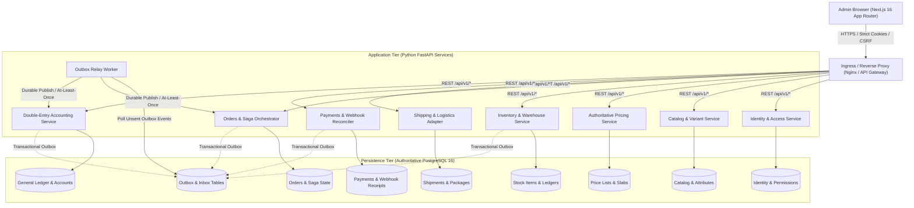
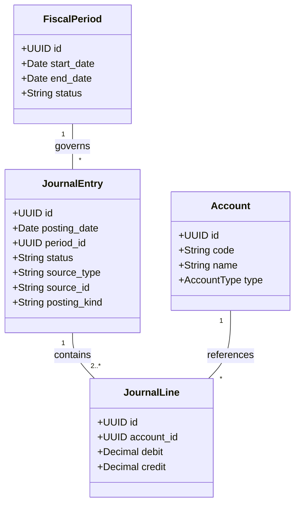

# 🏛️ Apollo Engineering Admin & Seller Enterprise Architecture

**Authoritative Target Specification**  
**Version:** 2.0.0  
**Domain:** Apollo Engineering Private Limited (`Kathwada GIDC, Ahmedabad 382430`)  

---

## 1. High-Level Architecture Overview

Apollo Engineering operates an enterprise-grade e-commerce and seller administration system built around a decoupled frontend interface, asynchronous Python microservices, and an authoritative PostgreSQL 16 relational database with double-entry accounting guarantees.



---

## 2. Microservice Deployment Map & Service Boundaries

| Service | Owns | Public / Internal Contracts | Important Outputs |
| :--- | :--- | :--- | :--- |
| **Identity** | Users, company memberships, roles, permissions, approval requests, audit logs | Session token verification, permission grants, actor context | Access revoked, roles changed, action approved |
| **Catalog** | Products, categories, attributes, attribute values, variant options, media assets | Product/variant CRUD, combination generator, media attachments | `catalog.product.published.v1`, `catalog.variant.updated.v1` |
| **Pricing** | Price lists, volume slabs, tax profiles, HSN rules, pricing policy versions | Authoritative versioned quote calculation, tax decomposition | `pricing.rule.changed.v1`, price overrides logged |
| **Inventory** | Warehouses, stock items, inventory balances, reservations, movements ledger | Reserve stock, release reservation, consume stock on dispatch | `inventory.reserved.v1`, `inventory.dispatched.v1` |
| **Orders** | Customers, quotes, orders, commercial snapshots, distributed saga state | Confirm order, cancel order, inspect order history, saga step tracking | `order.confirmed.v1`, `order.cancelled.v1` |
| **Shipping** | Carriers, rate cards, rate slabs, quotes, shipments, packages, tracking, returns | Generate shipping quote, book consignment, print thermal label, track | `shipment.booked.v1`, `shipment.delivered.v1`, `return.received.v1` |
| **Payments** | Payment intents, provider attempts, verified receipts, refunds, settlements | Create payment intent, verify signature (HMAC SHA-256), trigger refund | `payment.captured.v1`, `payment.refund.succeeded.v1` |
| **Accounting** | Fiscal periods, chart of accounts, statutory invoices, credit notes, journals | Issue invoice, post balanced journal, lock fiscal period, trial balance | `accounting.invoice.issued.v1`, `accounting.journal.posted.v1` |
| **Reporting** | Rebuildable materializations, background export jobs, audit reports | Query GSTR-1, P&L, balance sheet, trial balance, inventory valuation | Background job progress, CSV/Excel export artifacts |

---

## 3. Distributed Order & Fulfillment Saga

```mermaid
sequenceDiagram
    autonumber
    actor Buyer as Customer / Admin
    participant Orders as Order Orchestrator
    participant Pricing as Pricing Service
    participant Inventory as Inventory Service
    participant Payments as Payment Gateway / Service
    participant Shipping as Shipping Service
    participant Accounting as Accounting Service

    Buyer->>Orders: Submit Quote / Place Order
    Orders->>Pricing: Request Authoritative Calculation (Line-Total GST)
    Pricing-->>Orders: Versioned Quote Snapshot
    Orders->>Orders: Persist Order (DRAFT) & SagaInstance (RESERVING)
    
    Orders->>Inventory: Command: Reserve Stock (Row Lock / Conditional Update)
    alt Insufficient Stock
        Inventory-->>Orders: Reject: OUT_OF_STOCK
        Orders->>Orders: Mark Order CANCELLED; Saga FAILED
    else Stock Available
        Inventory->>Inventory: Increment reserved, create InventoryMovement & Outbox
        Inventory-->>Orders: Event: inventory.reserved.v1
        Orders->>Orders: Advance Saga to AWAITING_PAYMENT
    end

    alt Online Prepaid (Razorpay / UPI)
        Orders->>Payments: Create Payment Intent
        Payments-->>Buyer: Checkout Modal / Direct UPI QR
        Buyer->>Payments: Authorize & Capture Payment
        Payments->>Payments: Verify HMAC SHA-256 on Raw Body
        Payments-->>Orders: Event: payment.captured.v1
    else Cash on Delivery (COD)
        Orders->>Orders: Verify PIN & COD Surcharge Policy (Advance COD confirmation)
    end

    Orders->>Orders: Update OrderStatus = CONFIRMED, PaymentStatus = CAPTURED
    Orders->>Shipping: Command: Book Shipment (Origin: 382430 Kathwada)
    Shipping->>Shipping: Generate AWB & Code128 Thermal Label (104×148mm)
    Shipping-->>Orders: Event: shipment.booked.v1

    Shipping->>Inventory: Command: Consume Stock (Dispatch decrement on_hand & reserved)
    Inventory->>Inventory: Record DISPATCH movement in immutable ledger
    Inventory-->>Shipping: Confirmed Dispatch

    Orders->>Accounting: Event: order.dispatched.v1 (Invoice Trigger)
    Accounting->>Accounting: Generate Sequential FY Invoice (e.g. APE/26-27/0001)
    Accounting->>Accounting: Post Balanced Journal (Dr AR / Cr Revenue / Cr Output GST)
    Accounting-->>Orders: Event: accounting.invoice.issued.v1
```

### Saga State Transition Table

| Current State | Trigger | Guard / Preconditions | Local Transaction | Emitted Command / Event | Next State | Compensation / Timeout |
| :--- | :--- | :--- | :--- | :--- | :--- | :--- |
| `PENDING_QUOTE` | Submit Cart | Valid SKUs & Quantities | Insert Order (DRAFT) | `pricing.calculate.v1` | `CALCULATING_QUOTE` | Timeout 10s -> Stale quote error |
| `CALCULATING_QUOTE` | Quote Calculated | Valid pricing rules & active tax | Snapshot pricing in `order_items` | `inventory.reserve.v1` | `RESERVING_STOCK` | Missing tax/price -> Reject order |
| `RESERVING_STOCK` | `inventory.reserved.v1` | Stock balance reserved | Record reservation IDs in saga step | `payment.create_intent.v1` | `AWAITING_PAYMENT` | Expiry (15 min) -> `inventory.release.v1` |
| `AWAITING_PAYMENT` | `payment.captured.v1` | Verified HMAC signature & amount | Mark `payment_status = CAPTURED` | `shipping.book.v1` | `CONFIRMED` | Expired reservation race -> Operator resolution |
| `CONFIRMED` | `shipment.booked.v1` | Valid AWB & Carrier assigned | Update `fulfilment_status = READY_TO_SHIP` | `inventory.consume.v1` | `READY_FOR_DISPATCH` | Booking failure -> Retry with backoff |
| `READY_FOR_DISPATCH` | Carrier Manifest Handover | Scanned at origin hub (382430) | Update `fulfilment_status = SHIPPED` | `accounting.issue_invoice.v1` | `DISPATCHED` | Lost in transit -> Insurance claim |
| `DISPATCHED` | Carrier Delivered Webhook | POD signature verified | Update `fulfilment_status = DELIVERED` | None | `COMPLETED` | NDR / RTO -> Initiate Return Workflow |
| `ANY` | Cancellation Requested | Not yet dispatched | Set `order_status = CANCELLED` | `inventory.release.v1`, `payment.refund.v1` | `CANCELLED` | Post Credit Note in Accounting |

---

## 4. Double-Entry Accounting Architecture

Postings adhere to Indian Accounting Standards and statutory GST guidelines:



### Invariant Rules:
1. **Balance Check**: Every posted journal entry must satisfy $\sum \text{Debit} = \sum \text{Credit}$ rounded to 2 decimal places (`NUMERIC(14,2)`). Enforced via database triggers.
2. **One-Sided Line Rule**: Each line has either `debit > 0` and `credit = 0`, or `debit = 0` and `credit > 0`. Zero or dual-sided amounts are rejected.
3. **Period Lock**: No transaction can be posted into a `LOCKED` fiscal period without explicit Super Admin unlock authorization.
4. **Immutability**: Once `status = POSTED`, journal headers and lines can never be updated or deleted. Corrections require a linked reversal entry.
