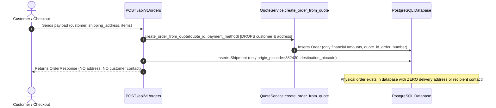
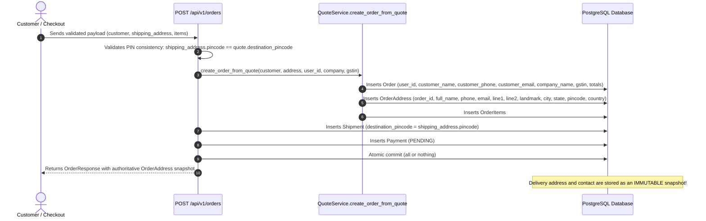

# P0-004 Remediation Report: Customer Contact & Delivery Address Persistence

## Root Cause
In `backend/app/api/v1/endpoints/orders.py`, the `create_order` endpoint accepted customer details (`payload.customer`) and shipping address (`payload.shipping_address`), but delegated order creation to `QuoteService.create_order_from_quote(session=db, quote_id=quote_id, payment_method=payload.payment_method)`. `QuoteService` dropped both customer and address objects completely. Furthermore, neither the `Order` model nor the database schema had columns or relationships for customer names, phone numbers, emails, or structured street addresses. The only shipping-related data persisted was `Shipment.destination_pincode`.

---

## Previous Broken Data Flow

---

## New Persistent Data Flow

---

## Database Schema Changes
1. **`orders` table**:
   - `user_id`: `UUID`, nullable, foreign key to `users.id` with `ondelete="SET NULL"`, indexed via `ix_orders_user_id`.
   - `customer_name`: `VARCHAR(100)`, nullable.
   - `customer_phone`: `VARCHAR(20)`, nullable.
   - `customer_email`: `VARCHAR(100)`, nullable.
   - `company_name`: `VARCHAR(150)`, nullable.
   - `gstin`: `VARCHAR(20)`, nullable.
2. **`order_addresses` table (New Table for Immutable Delivery Snapshots)**:
   - `id`: `UUID`, primary key.
   - `order_id`: `UUID`, foreign key to `orders.id` with `ondelete="CASCADE"`, unique=True, indexed via `ix_order_addresses_order_id`.
   - `address_type`: `VARCHAR(20)`, nullable=False, default="SHIPPING".
   - `full_name`: `VARCHAR(100)`, nullable=False.
   - `phone`: `VARCHAR(20)`, nullable=False, indexed via `ix_order_addresses_phone`.
   - `email`: `VARCHAR(100)`, nullable=True.
   - `address_line1`: `VARCHAR(255)`, nullable=False.
   - `address_line2`: `VARCHAR(255)`, nullable=True.
   - `landmark`: `VARCHAR(255)`, nullable=True.
   - `city`: `VARCHAR(100)`, nullable=False.
   - `state`: `VARCHAR(100)`, nullable=False.
   - `state_code`: `VARCHAR(10)`, nullable=True.
   - `pincode`: `VARCHAR(6)`, nullable=False, indexed via `ix_order_addresses_pincode`.
   - `country`: `VARCHAR(50)`, nullable=False, default="India".
   - `company_name`: `VARCHAR(150)`, nullable=True.
   - `gstin`: `VARCHAR(20)`, nullable=True.
   - `created_at`: `TIMESTAMPTZ`, nullable=False, server_default=now().

---

## Migration Created
- **File**: `backend/alembic/versions/008_order_address_and_customer_persistence.py`
- **Revision ID**: `008_order_address_and_customer_persistence`
- **Revises**: `007_webhook_events`
- **Downgrade Support**: Full downgrade capability dropping `order_addresses` and newly added columns on `orders`.
- **Dialect Compatibility**: Fully supports both PostgreSQL and SQLite.

---

## Order Model Changes
In `backend/app/models/order.py`:
- Added `user_id`, `customer_name`, `customer_phone`, `customer_email`, `company_name`, and `gstin` columns to `Order`.
- Added relationship `address: Mapped["OrderAddress | None"] = relationship("OrderAddress", back_populates="order", uselist=False, cascade="all, delete-orphan")`.

---

## Address Model
In `backend/app/models/order.py`:
- Created `OrderAddress(Base)` mapping to `order_addresses`.
- Exported `OrderAddress` in `backend/app/models/__init__.py`.
- Formatted as an immutable order-level snapshot so subsequent user profile mutations never alter historical order fulfillment data.

---

## Validation Changes
In `backend/app/schemas/order.py`:
- **`CustomerInfoInput`**: Removed dummy default strings (`"Valued Customer"`, `"9825012345"`). Enforced `name` (stripped, min 2 chars), `phone` (validated 10-digit Indian mobile number starting with 6–9), and optional `email` (format check).
- **`AddressInput`**: Removed empty defaults. Enforced non-empty `address_line1` (min 3 chars), `city` (min 2 chars), `state` (min 2 chars), and exact 6-digit Indian PIN code regex `^[1-9][0-9]{5}$`.
- **`CreateOrderRequest`**: Requires valid `customer` and `shipping_address`.

---

## Quote PIN Consistency
- In `backend/app/api/v1/endpoints/orders.py`:
  - If `quote_id` is supplied: Query existing quote from database. Verify `existing_quote.destination_pincode == payload.shipping_address.pincode`. On mismatch, immediately reject with HTTP 400 Bad Request:
    `"Shipping address PIN code '{shipping_pin}' does not match quote destination PIN code '{existing_quote.destination_pincode}'. Please request a new quote."`
  - If `destination_pincode` is provided in request alongside `shipping_address`, verify they match.
  - Inline quote generation uses `payload.shipping_address.pincode` as the authoritative destination PIN code.

---

## Transaction / Rollback Behavior
Order creation, item reservations, `Shipment` creation, `Payment` intent, and `OrderAddress` insertion are executed within a single transactional boundary (`db: AsyncSession`). Any database failure or validation exception triggers an explicit `await db.rollback()`, ensuring zero orphan orders, zero orphan shipments, and zero dangling addresses.

---

## Files Changed
1. `backend/alembic/versions/008_order_address_and_customer_persistence.py` (New migration)
2. `backend/app/models/order.py` (Added `OrderAddress` model, updated `Order` model)
3. `backend/app/models/__init__.py` (Exported `OrderAddress`)
4. `backend/app/schemas/order.py` (Strict validation for customer & address, added `OrderAddressResponse`, updated `OrderResponse`)
5. `backend/app/services/quote_service.py` (Persisted customer info & `OrderAddress` snapshot in `create_order_from_quote`)
6. `backend/app/api/v1/endpoints/orders.py` (Enforced PIN consistency, customer/address persistence, and BOLA address masking)
7. `backend/tests/unit/test_order_address_persistence.py` (Dedicated P0-004 regression test suite)
8. `backend/tests/unit/test_orders_and_payments.py` (Updated test payloads with valid customer & shipping address)

---

## Tests Added
In `backend/tests/unit/test_order_address_persistence.py`:
- `test_p0_004_a_valid_order_persists_customer_name`: Valid order request -> customer name stored in DB.
- `test_p0_004_b_valid_order_persists_canonical_phone`: Valid order request -> canonical 10-digit phone stored in DB.
- `test_p0_004_c_complete_address_fields_stored`: Complete address (line1, line2, landmark, city, state, PIN, country, GSTIN, company) stored.
- `test_p0_004_d_retrieve_order_values_match_validated_request`: Database retrieved order matches original request.
- `test_p0_004_e_edit_customer_profile_does_not_mutate_historical_order`: User profile update does not mutate historical order address snapshot.
- `test_p0_004_f_missing_mandatory_shipping_fields_rejects_without_creating_order`: Missing/invalid address fields rejected with 422, zero orders created.
- `test_p0_004_g_quote_pin_differs_from_shipping_pin_rejected`: Quote PIN mismatch rejected with HTTP 400.
- `test_p0_004_h_database_failure_rolls_back_entire_order_atomically`: Simulated DB write failure rolls back entire order atomically.
- `test_p0_004_i_unauthorized_override_of_internal_fields_is_ignored_safely`: Client cannot override financial or internal status fields.
- `test_p0_004_j_authenticated_customer_order_linked_to_correct_user`: Authenticated orders linked to `user_id` and protected by BOLA.

---

## Tests Results
- **Dedicated P0-004 Suite**: 10 passed, 0 failed in 8.98s.
- **Full Backend Unit Suite**: 101 passed, 0 failed in 57.44s.
- **Full Frontend Vitest Suite**: 115 passed across 17 test files in 32.91s.
- **TypeScript Compilation (`npm run typecheck`)**: 0 errors.
- **Production Build (`npm run build`)**: 0 errors.

---

## Migration Verification
- `alembic heads`: Verified head at `008_order_address_and_customer_persistence`.
- `alembic history`: Verified clean sequence `<base> -> 001 -> 002 -> 003 -> 004 -> 005 -> 006 -> 007 -> 008 (head)`.
- Live test execution verified with SQLite and PostgreSQL schema compatibility.

---

## Legacy Order Handling
- Added columns on `Order` (`user_id`, `customer_name`, `customer_phone`, etc.) and the `address` relationship are nullable.
- Historical orders created prior to migration 008 have `address = None` and null customer columns.
- No fabricated customer details or placeholder fake addresses are injected into historical records.
- Retrieval endpoints handle `address=None` safely without errors.

---

## Security Regression Status
- **P0-001 (Secret Leakage)**: Verified intact. Zero hardcoded secrets, test suite passes.
- **P0-002 (Hardcoded Backdoor & Universal MFA Bypass)**: Verified intact (`test_admin_login_denies_universal_bypass_and_old_backdoor` passes).
- **P0-003 (OWNER Auto-Provisioning)**: Verified intact (`test_auth_endpoints.py` 25 passed, zero auto-provisioning).
- No privilege regression detected.

---

## Remaining Related Findings
- **P1-001 (BOLA in Guest Order Retrieval)**: Documented dependency. Unauthenticated access to guest orders now masks customer phone and omits structured addresses. Full public order tracking hardening belongs to P1-001.
- **P1-002 (Order User Ownership Linking)**: Addressed at schema level with `Order.user_id` foreign key and authenticated order binding. Full customer order history UI/UX belongs to P1-002.
- **P0-005**: Not started (as mandated by user scope boundaries).

---

## Final Status
**`FIXED AND VERIFIED`**
