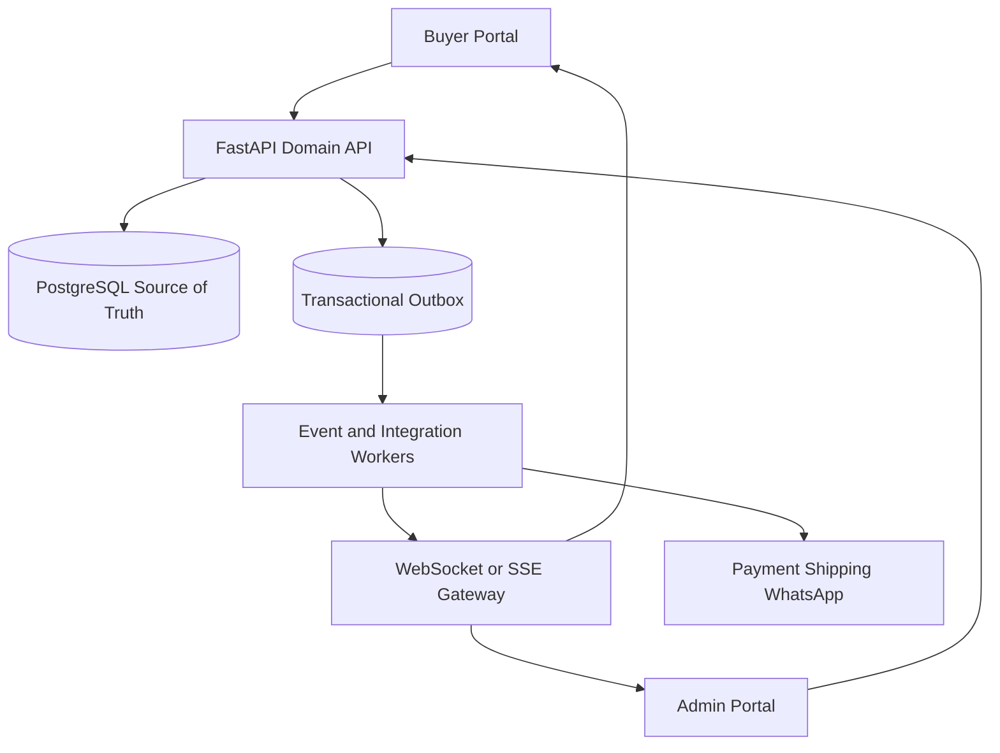

# Apollo E-commerce Architecture Contract

## System shape

Start as a modular monolith unless measured load justifies separation.

Redis can support cache, rate limiting, background jobs and real-time fan-out. All recoverable state must be rebuildable from PostgreSQL.

## Domain modules

| Module | Authority |
| --- | --- |
| Identity | users, roles, sessions and authorization |
| Catalog | products, variants, HSN and media references |
| Pricing | price versions, tax modes, discounts and calculation versions |
| Inventory | stock movements, reservations and availability |
| Quote | authoritative priced snapshot with expiry |
| Order | immutable placed-order snapshot and state machine |
| Payment | attempts, captures, refunds and provider events |
| Shipping | serviceability, quotes, AWB, tracking and COD collectible |
| Replacement | evidence, approvals, charges and linked shipment |
| Notification | templated delivery attempts by language/channel |
| Audit | append-only actor/action/reason/change evidence |

## Real-time contract

1. Validate command and authorization.
2. Commit business change plus outbox record in one transaction.
3. Return authoritative resource/version.
4. Worker publishes event after commit.
5. Buyer/admin portal receives event and refreshes affected resource.
6. Reconnect uses last event cursor; gaps trigger REST refetch.

Real-time transport failure must not lose or corrupt the committed business transaction.

## Concurrency contract

- Every mutable aggregate has a version.
- Stale writes return a conflict with current state.
- Inventory reservation uses atomic conditional update or row lock.
- Idempotency keys guard order/payment/shipping commands.
- Unique constraints guard provider event IDs and invoice numbers.

## External provider contract

Provider payloads are untrusted inputs. Adapters validate signature, identity, amount, currency, event type and allowed internal transition. Raw provider status is stored for evidence, but internal state changes through domain commands only.
