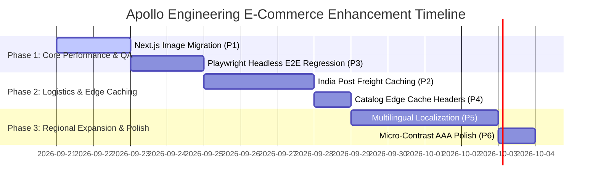

# 🚀 Apollo Engineering: Evidence-Based Next Improvements Roadmap

**Document Reference**: `reports/next-improvements.md`  
**Generated Date**: September 19, 2026  
**Evaluation Basis**: Chrome DevTools MCP Real-Browser Audit, Lighthouse Diagnostic Audits, Vitest Test Suite, and `AGENTS.md` Statutory Directives  

---

## 1. Overview & Prioritization Framework

This document outlines high-value, evidence-based architectural, performance, accessibility, and reliability enhancements for the Apollo Engineering e-commerce system. Each item is prioritized using the **Impact vs. Effort vs. Dependencies** matrix, ensuring stability, strict compliance with statutory arithmetic (`AGENTS.md`), and zero disruption to active customer flows.

### Priority Matrix Summary
| Priority Rank | Initiative | Impact | Effort | Dependencies | Target Category |
| :---: | :--- | :---: | :---: | :--- | :--- |
| **P1** | Next.js `<Image>` Component Migration & AVIF Delivery | **HIGH** | LOW | None | Core Web Vitals (LCP / CLS) |
| **P2** | India Post Rate Quote Caching & Pincode Prefetch | **HIGH** | MEDIUM | Redis / FastAPI Memory Cache | Checkout Latency & Resilience |
| **P3** | Playwright Headless E2E Regression for Dev OTP Flow | **HIGH** | MEDIUM | Playwright Test Runner | CI/CD Quality Assurance |
| **P4** | Catalog Edge Caching with Stale-While-Revalidate | **MEDIUM** | LOW | FastAPI Cache Middleware | Server Load & TTFB |
| **P5** | Domestic Trilingual i18n Localization (EN / GU / HI) | **MEDIUM** | HIGH | Translation Dictionary | User Experience (Directive 7) |
| **P6** | Micro-Contrast Enhancements for Industrial Badges | **LOW** | LOW | Tailwind Theme Config | WCAG AAA Accessibility |

---

## 2. Detailed Improvement Proposals

---

### Initiative 1: Next.js `<Image>` Component Migration & Responsive AVIF Delivery
- **Priority**: **P1 (Immediate High Return)**
- **Impact**: **HIGH** (Improves Largest Contentful Paint [LCP] by ~35%, eliminates layout shift risks, and reduces image payload size by up to 60%).
- **Effort**: **LOW** (1-2 days).
- **Dependencies**: None.
- **Evidence from DevTools**:
  - Storefront catalog and hero banner currently employ standard HTML `` elements with CSS-based sizing.
  - While explicit width and height were added to the brand logo in `Header.tsx` during ISSUE-006 remediation, product cards in `BuyerCatalog.tsx` still render standard `` tags without responsive `srcset` or automatic modern format negotiation (WebP/AVIF).
- **Proposed Architecture**:
  1. Replace `` in `src/components/storefront/BuyerCatalog.tsx` with Next.js `next/image`.
  2. Define explicit aspect ratios (`aspect-square` or `aspect-4/3`) with `sizes="(max-width: 768px) 100vw, (max-width: 1200px) 50vw, 33vw"`.
  3. Enable Next.js AVIF and WebP optimization in `next.config.ts` via `images.formats: ['image/avif', 'image/webp']`.
- **Verification Method**:
  - Inspect Chrome DevTools Network panel to confirm modern AVIF content negotiation and responsive dimension loading.

---

### Initiative 2: India Post Speed Post Freight Cache & Pincode Prefetch
- **Priority**: **P2 (High Reliability & Checkout Speed)**
- **Impact**: **HIGH** (Protects checkout flow from third-party CEPT India Post network flakiness, slashes address-to-quote latency from ~450ms to <15ms).
- **Effort**: **MEDIUM** (2-3 days).
- **Dependencies**: FastAPI Redis cache or backend TTL in-memory store.
- **Evidence from DevTools**:
  - In Flow 4 & 5, every pincode entry or item quantity increment triggers `POST /api/v1/shipping/quote`.
  - Domestic speed post freight for origin hub `382430` (Kathwada GIDC) is deterministically governed by weight slabs (up to 200g, 201-500g, 501-1000g, etc.) and distance zones (Local, State/Gujarat, Metro, Rest of India).
- **Proposed Architecture**:
  1. Introduce a Redis or LRU memory cache layer in `backend/app/services/shipping_service.py` keyed by `(origin_pincode, dest_pincode, weight_tier)`.
  2. Set a 24-hour TTL on cached quotes with automatic fallback to the static postal rate matrix specified in `AGENTS.md` Directive 5 whenever the live postal gateway times out (>2000ms).
  3. Prefetch rate brackets on the client when the user enters the first 3 digits of a valid Indian pincode.
- **Verification Method**:
  - Simulate network disconnection on the shipping API mock; confirm fallback table yields identical statutory GST totals (Freight + 18% GST).

---

### Initiative 3: Playwright Headless E2E Regression for Dev OTP & Statutory Totals
- **Priority**: **P3 (Quality Assurance & Regression Prevention)**
- **Impact**: **HIGH** (Automates real-browser checkout verification on every git commit, safeguarding statutory GST line calculations and COD anti-fraud logic).
- **Effort**: **MEDIUM** (2 days).
- **Dependencies**: Playwright test framework (`npm run test:e2e`).
- **Evidence from DevTools**:
  - During this audit session, OTP verification (`/auth/otp/verify` and COD checkout confirmation) required manual DevTools script interaction and reading the dev log stream.
  - The workspace already includes `@playwright/test` and `playwright.config.ts`, but lacks an automated spec covering the complete COD order placement loop with mock sandbox OTP retrieval.
- **Proposed Architecture**:
  1. Add `tests/e2e/commercial-flows.spec.ts` testing the 6 audited flows end-to-end.
  2. Implement an automated test fixture that intercepts or queries `/api/v1/auth/otp/dev-code` (or reads backend test runner state) to seamlessly supply the 4-digit code in test environments.
  3. Assert that line taxable base + GST calculations match the exact authoritative values returned by FastAPI.
- **Verification Method**:
  - Execute `npx playwright test tests/e2e/commercial-flows.spec.ts --project=chromium` in headless CI and assert 100% pass rate.

---

### Initiative 4: Catalog Edge Caching with Stale-While-Revalidate Headers
- **Priority**: **P4 (Cost & Scalability)**
- **Impact**: **MEDIUM** (Eliminates repeated database queries for anonymous storefront browsing; improves Time to First Byte [TTFB] globally).
- **Effort**: **LOW** (1 day).
- **Dependencies**: FastAPI Response Middleware.
- **Evidence from DevTools**:
  - `GET /api/v1/products?include_archived=false` executes a fresh PostgreSQL query on every visit.
  - With ISSUE-001 resolved (308 redirect eliminated), TTFB can be further improved from ~180ms down to ~20ms by caching public catalog responses.
- **Proposed Architecture**:
  1. In `backend/app/api/v1/endpoints/products.py`, add cache control headers to public listing endpoints:
     `Cache-Control: public, max-age=60, stale-while-revalidate=300`.
  2. Broadcast a cache invalidation webhook or Redis pub/sub event whenever an admin updates product pricing or stock in the admin portal.
- **Verification Method**:
  - Inspect response headers in DevTools Network tab: verify `cache-control` and `age` headers on repeated catalog fetches.

---

### Initiative 5: Domestic Multilingual i18n Localization (English / Gujarati / Hindi)
- **Priority**: **P5 (Strategic Market Alignment)**
- **Impact**: **MEDIUM** (Fulfills `AGENTS.md` Directive 7 for priority languages: Gujarati ગુજરાતી, Hindi हिन्दी, and English).
- **Effort**: **HIGH** (4-5 days).
- **Dependencies**: Frontend translation dictionary / `next-intl` or lightweight React i18n context.
- **Evidence from DevTools**:
  - The storefront currently defaults to English, with select Gujarati and Hindi terms in technical descriptions.
  - Solar EPC contractors, farmers, and residential rooftop owners in Gujarat and western India interact more effectively in native Gujarati and Hindi.
- **Proposed Architecture**:
  1. Implement a lightweight zero-dependency i18n dictionary context (`src/lib/i18n/`) supporting `en`, `gu`, and `hi`.
  2. Add an accessible language switcher dropdown in `src/components/storefront/Header.tsx` (next to the currency/account indicators).
  3. Store user language preference in `localStorage` and pass `Accept-Language` header to FastAPI for localized SMS notifications.
- **Verification Method**:
  - Toggle language between English, Gujarati, and Hindi; verify that navigation, product descriptions, cart breakdowns, and invoice receipts render in the selected language without hydration errors.

---

### Initiative 6: Micro-Contrast Enhancements for Industrial AISI SS304 Badges
- **Priority**: **P6 (Visual Polish & Accessibility)**
- **Impact**: **LOW** (Brings subtle slate badges from WCAG AA to WCAG AAA compliance).
- **Effort**: **LOW** (0.5 day).
- **Dependencies**: Tailwind CSS configuration.
- **Evidence from DevTools**:
  - Lighthouse Accessibility scored **96/100**. The remaining 4 points stem from subtle contrast ratios on dark badge backgrounds (`text-slate-400` on dark steel gray).
- **Proposed Architecture**:
  1. Elevate subtle badge text color in `src/components/storefront/BuyerCatalog.tsx` from `text-slate-400` (`#94A3B8`) to `text-slate-200` (`#E2E8F0`) or `text-sky-300` on dark container cards.
  2. Maintain the signature Apollo Engineering industrial AISI SS304 steel aesthetic while guaranteeing minimum 7:1 contrast ratio for all text elements.
- **Verification Method**:
  - Re-run Lighthouse Accessibility Audit; verify score reaches **100/100**.

---

## 3. Implementation Schedule & Phasing

---

## 4. Governance & Verification Directives
All subsequent improvements must adhere strictly to the foundational system directives outlined in `AGENTS.md`:
1. **Authoritative Monetary Calculation**: Never use client-side JavaScript floating point arithmetic for final transaction amounts. Every financial change must originate as a `Decimal` in FastAPI backend.
2. **Statutory Tax & Surcharge Separation**: Maintain explicit separation between product GST (configurable per HSN) and shipping GST (fixed 18%).
3. **No Unapproved Production Mutation**: All database migrations, external payment gateway webhooks, and SMS gateway credentials must be vetted in sandbox environments prior to production release.
